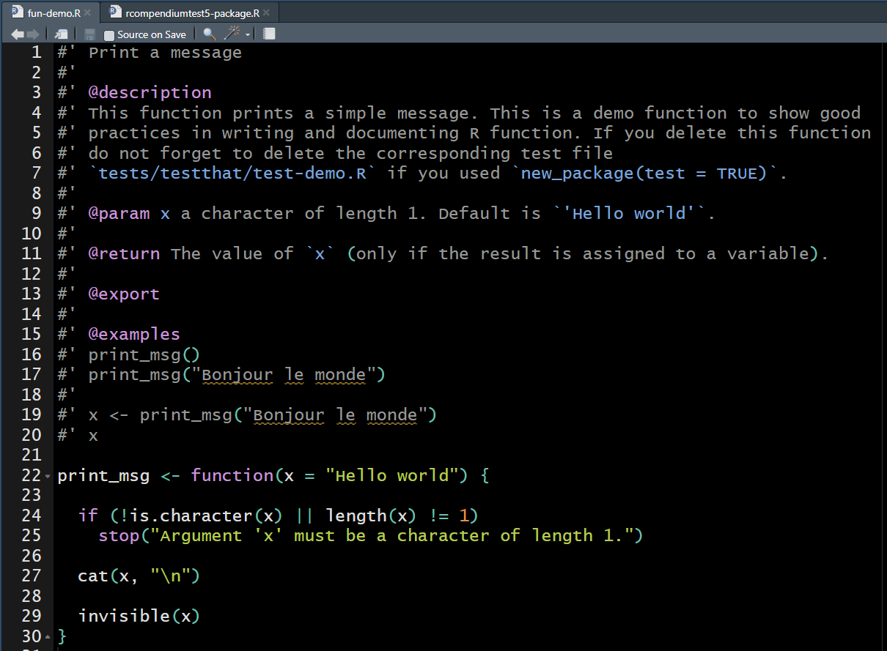

:::::::::::::::::::::::::::::::::::::: questions 

- Where can I add my functions?
- How do I need to document my functions?
- How can I read the documentation of my functions?
- How can I write a manuscript with my project outputs?

::::::::::::::::::::::::::::::::::::::::::::::::

::::::::::::::::::::::::::::::::::::: objectives

- Write your functions documentation following the `{rcompendium}` template.
- Load your functions and update its documentation using `{devtools}`.
- Create a website for the project using `{usethis}`.
- Create a manuscript template with `{rrtools}`.

::::::::::::::::::::::::::::::::::::::::::::::::

## What about my functions?

### How do I write my functions documentation?

We must __write__ our custom functions as _Modular functions_ and save them in the `R/` folder. 
You can __write__ the documentation of your functions following a [standard documentation method](https://r-pkgs.org/man.html). The `{rcompendium}` template already contains a `fun-demo.R` for this. 



:::callout

Remember that _documented functions_ can facilitate further efforts to reuse them and create a specific R package!

:::


### How do I load my functions?

To __load__ your project functions, as written in `line 20` of the `make.R` file, run:

```r
devtools::load_all(here::here())
```

### How do I read my functions documentation?

Is there an easier way to read the documentation of my _modular functions_? 

Remember that after you write the documentation of new functions on the `R/` folder, you must update your function and project documentation files, which are in _different_ files and folders. To do this run:

```r
devtools::document()
```

This last step will update the following:

- `man/` folder, which stores the project documentation, and 
- the `NAMESPACE`, that registers the functions that your project exports for your data analysis to run.

Lastly, you can ask with `?function` in the `Console` and read the documentation for your functions, as any other function from the packages you installed. Try to run this:

```r
?print_msg
```


## Create a project website

An alternative way to navigate all the files generated by the `{rcompendium}` template is with a website. 

We can create a website using [GitHub pages](https://pages.github.com/). To make this possible run:

```r
usethis::use_pkgdown_github_pages()
```

This function implements the GitHub setup needed to automatically publish your site to GitHub pages using the [`{pkgdown}` package](https://pkgdown.r-lib.org/).

This output is possible in two steps: 

- First, it prepares to _publish_ the pkgdown site from a new `gh-pages` branch. 
- Then, it configures a [GitHub Action](https://github.com/features/actions) to automatically _build_ the site and _deploy_ it via GitHub Pages.

Lastly, the `pkgdown` site's URL is added to the `pkgdown` configuration file, to the URL field of `DESCRIPTION`, and to the GitHub repo.

Commit and Push your changes.

:::callout

Remember that when using _GitHub Actions_, next to the `SHA/hash` will be the _status icon_ of the actions. 

- Yellow ball for "Job running", 
- Red cross for "Failed Run", and 
- Green check for "job done!".

:::

Please wait for it to get green and inspect the Reference tab on the navigation bar.

Now, let's compare the `fun-demo.R` file, the `?print_msg` output, and the website format:


:::callout

A `pkgdown` website format can facilitate the navigation through: 

- Community files and 
- Function documentation.

:::

:::instructor

If required, you can add vignettes for an `{rcompendium}` using: 

```r
rcompendium::add_vignette(filename = "vignette-01")
```

Vignettes look more suitable for package documentation than a project. But knowing that we have that alternative with the `{rcompendium}` template is helpful.

:::

## How do I write a manuscript for my project?

You can use handy functions from another research compendium package called `{rrtools}`.

To get a template of files required to fill a manuscript run:

```r
rrtools::use_analysis(location = "inst", data_in_git = FALSE)
```

This function will create a folder `inst/` with a new set of folders for data and figures. You can avoid using them and only use the `.qmd` as a template for your manuscript.


The `.qmd` files get formatted from several template files like references using `.bib` and citation style using `.csl`.


Using `rrtools::use_analysis()` with those arguments will not modify your `{rcompendium}` configuration. Other functions can change it. 

:::instructor

This manuscript will not be visible on a website unless moved to the `vignette/` folder. We have yet to test that behaviour.

:::

:::callout

Remember that if you have all your changes as commits with git, you can _revert_ any modification with the button __`Revert`__, located between the `Stage` and `Ignore` buttons.


:::

::::::::::::::::::::::::::::::::::::: keypoints 

- Write your functions documentation following the `R/fun-demo.R` template.
- Run your project functions with `devtools::load_all()`.
- Update your functions documentation with `devtools::document()`.
- Read your functions documentation with the `?function` notation in the R console.
- Create a website for the project with `usethis::use_pkgdown_github_pages()`.
- Use a manuscript template with `rrtools::use_analysis(location = "inst", data_in_git = FALSE)`.

::::::::::::::::::::::::::::::::::::::::::::::::

