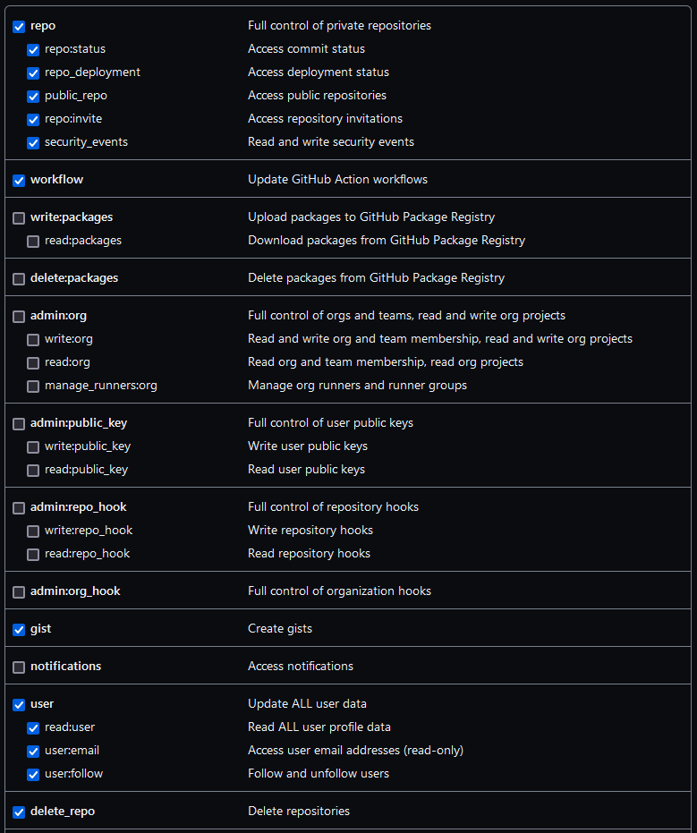

We will use this site for the workshop on "Improving the reliability, usability and sustainability of code for epidemic analysis with R packages" at [IDDconf 2023](https://iddconf.org/).

Follow these instructions to prepare for the event.

<!--
## Data Sets

FIXME: place any data you want learners to use in `episodes/data` and then use
       a relative link ( [data zip file](data/lesson-data.zip) ) to provide a
       link to it, replacing the example.com link.

We will use data from an Ebola virus disease outbreak in a fictional country in West Africa:

- `linelist_20140701.xlsx`: a linelist containing case information up to the 1st of July 2014.

[Download this data file](https://github.com/reconhub/learn/raw/master/static/data/linelist_20140701.xlsx) and keep it in your Desktop.
-->

## Software Setup

### Install Rstudio

Install R and Rstudio <https://posit.co/download/rstudio-desktop/>

### Create a GitHub account

Create a GitHub account <https://github.com/>

### Install Git

::::::::::::::::::::::::::::::::::::::: discussion

### Follow software specific suggestions

Follow [happygitwithr recommendation](https://happygitwithr.com/install-git.html) for each Operating system.


:::::::::::::::::::::::::::::::::::::::::::::::::::

:::::::::::::::: solution

### Windows

For [Windows](https://happygitwithr.com/install-git.html#install-git-windows)

:::::::::::::::::::::::::

:::::::::::::::: solution

### MacOS

For [MacOS](https://happygitwithr.com/install-git.html#macos)

:::::::::::::::::::::::::


:::::::::::::::: solution

### Linux

For [Linux](https://happygitwithr.com/install-git.html#linux)

:::::::::::::::::::::::::

### Install R packages

These installation steps could ask you `? Do you want to continue (Y/n)` write `y` and press ENTER. It can take up to 3 minutes to complete.

First, we strongly suggest to install the development versions of the `rcompendium` and `rrtools` packages:

```r
if (!require("remotes")) install.packages("remotes")

remotes::install_github("FRBCesab/rcompendium")
remotes::install_github("benmarwick/rrtools")
```

Then, install all these packages:

```r
if(!require("pak")) install.packages("pak")

new <- c("gh",
         "usethis",
         "tidyverse",
         "here",
         "yaml",
         "renv")

pak::pak(new)
```

### Configure Git and GitHub

::: prereq

### Follow all these steps

In these steps, we will verify that you have:

- a correctly configured _token_, and
- a clean output when running `usethis::git_sitrep()`.

#### 1. Verify your git configuration

Use `gh::gh_whoami()` to check if your local git configuration recognizes:

- your name
- your GitHub account
- your _token_

```r
gh::gh_whoami()
```

```output
{
  "name": "Andree Valle Campos",
  "login": "avallecam",
  "html_url": "https://github.com/avallecam",
  "scopes": "gist, repo, workflow",
  "token": "gho_...AlAn"
}

```

If you do not have a _token_, follow step number 3.

#### 2. Get a situational report on your current Git/GitHub status:

Use `usethis::git_sitrep()` to check if there is no `✖ ...` line in the output with an error message. 

An example with two errors is below:

```r
usethis::git_sitrep()
```

```error
✖ Token lacks recommended scopes:
  - 'user:email': needed to read user's email addresses
  Consider re-creating your PAT with the missing scopes.
  `create_github_token()` defaults to the recommended scopes.
✖ Can't retrieve registered email addresses from GitHub.
  Consider re-creating your PAT with the 'user' or at least 'user:email' scope.
```

The output shows that I had a _token_ but must fix its configuration. If you do not have a _token_ or get a similar error message, follow the next step. 

If you have an error message unrelated to creating a token, copy and paste this output in your issue report to the email at the end of this page.  


#### 3. Create your GitHub token:

Do this with `usethis::create_github_token()`. This function should redirect you to GitHub on your browser. Once there, check all the options in the figure below.

```r
usethis::create_github_token()
```

Check all of the following options:



#### 4. Configure your token

To complete the configuration of your token use `gitcreds::gitcreds_set()` ([Ref]((https://happygitwithr.com/https-pat.html)), then accept that you want to `2: Replace these credentials`. Do this by writing the number `2` and press ENTER.

```r
gitcreds::gitcreds_set()
```

```output
-> What would you like to do? 

1: Abort update with error, and keep the existing credentials
2: Replace these credentials
3: See the password / token

Selection: 2

```


#### 5. Run again the situational report:

Verify again that there is no `✖ ...` line in the output with an error message. The expected outcome should look like this:

```r
usethis::git_sitrep()
```

```output
Git config (global)
• Name: 'Andree Valle'
• Email: 'avallecam@gmail.com'
• Global (user-level) gitignore file: <unset>
• Vaccinated: FALSE
ℹ See `?git_vaccinate` to learn more
• Default Git protocol: 'https'
• Default initial branch name: 'master'
GitHub
• Default GitHub host: 'https://github.com'
• Personal access token for 'https://github.com': '<discovered>'
• GitHub user: 'avallecam'
• Token scopes: 'delete_repo, gist, repo, user, workflow'
• Email(s): 'avallecam@gmail.com (primary)', 'andree.valle-campos@lshtm.ac.uk'
Git repo for current project
ℹ No active usethis project
```

If you still have an error. Copy and paste this output in your issue report to the email at the end of this page. 

#### 6. Two-factor authentication

If you have an error message related to Two-factor authentication, follow the [steps in this GitHub guide](https://docs.github.com/en/authentication/securing-your-account-with-two-factor-authentication-2fa/configuring-two-factor-authentication).


:::

### Configure your R environment

::: prereq

### Follow all these steps

#### 1. Set the default Git branch name

Run the code chunk below:

```r
usethis::git_default_branch_configure(name = "main")
```

This step will homogenize the name of the default branch in our computers. We need this to make some auto-generated links work downstream.

#### 2. Add {rcompendium} credentials

Use `rcompendium::set_credentials()` to add our name and personal information to the `.Rprofile` configuration file. 

Adapt the code chunk below to your name, family name, email, and ORCID. Adding your ORCID is optional.

```r
rcompendium::set_credentials(
  given = "Andree",
  family = "Valle-Campos",
  email = "avallecam@gmail.com",
  orcid = "0000-0002-7779-481X"
)
```

You can access the content of the `.Rprofile` file with `usethis::edit_r_profile()`.

:::

## Your Questions

If you need any assistance installing the software, configuring Git and GitHub, or have any other questions about the workshop, please send an email to <andree.valle-campos@lshtm.ac.uk>

